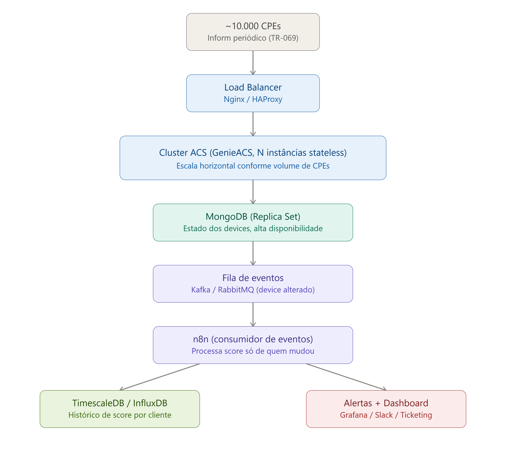

# Projetos_Rede — Laboratório TR-069/TR-181 (GenieACS)

Ambiente de estudo/laboratório para entender, na prática, como funciona o gerenciamento remoto de CPEs (roteadores, ONTs, gateways) via **TR-069/CWMP**, usando o **TR-181** como modelo de dados — e como isso escalaria numa arquitetura real de provedor com milhares de dispositivos.

## O que este projeto demonstra

- Como um ACS (Auto Configuration Server) gerencia CPEs remotamente via TR-069
- Como o modelo de dados TR-181 estrutura parâmetros (estatísticas, diagnósticos, Wi-Fi, sinal óptico, etc)
- Como escalar um ACS horizontalmente em cluster, com as pegadinhas reais disso (sessão CWMP presa ao processo, sticky session)
- Como desacoplar ingestão de eventos de alta carga (Kafka) da camada de automação/decisão (n8n)

## Arquitetura



```
CPEs simulados (genieacs-sim)
        ↓
Nginx (load balancer, sticky session via ip_hash na porta CWMP)
        ↓
Cluster GenieACS (2 instâncias, MongoDB compartilhado)
        ↓ (extension script, publica direto via kafkajs)
Kafka (tópico device-events)
        ↓
Consumer (em construção)
   ├── PostgreSQL   → histórico de eventos/estatísticas
   ├── Redis        → estado/cache em tempo real
   ├── API          → consulta programática
   └── n8n          → alertas e automações leves (baixo volume)
```

**Por que o n8n saiu do caminho de ingestão:** inicialmente o GenieACS notificava o n8n via webhook, que publicava no Kafka. Com a carga de eventos (ex: 100+ CPEs enviando Inform quase simultaneamente), esse hop HTTP extra virou gargalo desnecessário. A extension do GenieACS agora publica **direto** no Kafka via `kafkajs`. O n8n ficou reservado só pra consumo de baixo volume — alertas, dashboards, disparos condicionais — onde o overhead de um workflow visual não é problema.

**Por que sticky session no load balancer:** uma sessão CWMP é uma sequência de múltiplas trocas HTTP (Inform → resposta → RPCs → fim de sessão) que precisa ser atendida **pela mesma instância do GenieACS** do início ao fim — o contexto da sessão fica vinculado ao processo que a iniciou, não é compartilhado entre instâncias via MongoDB. Sem isso, ocorre o erro `Invalid session` quando o Nginx alterna a requisição pra outra instância no meio de uma sessão.

## Como rodar

Pré-requisitos: Docker e Docker Compose.

```bash
docker compose up -d
docker compose --profile testing up -d   # sobe os CPEs simulados
```

Serviços disponíveis:

| Serviço | URL/Porta | O que é |
|---|---|---|
| GenieACS UI | http://localhost:3000 | Interface de administração (via Nginx) |
| GenieACS NBI | http://localhost:7557 | API REST pra scripts/automação |
| GenieACS CWMP | :7547 | Porta onde os CPEs se conectam |
| Kafka UI | http://localhost:8081 | Visualizar tópicos/mensagens do Kafka |
| n8n | http://localhost:5678 | Automações e alertas |
| MongoDB | :27017 (localhost) | Banco do GenieACS (ex: pra conectar via Compass) |

## Estrutura do repositório

| Arquivo/Pasta | Descrição |
|---|---|
| `docker-compose.yml` | Orquestração de todos os serviços (GenieACS cluster, Mongo, Nginx, Kafka, n8n) |
| `nginx.conf` | Load balancer com sticky session (`ip_hash`) na porta CWMP |
| `extensions/` | Extension scripts do GenieACS (ex: publicação de eventos no Kafka) |
| `notify_provision.js` | Provisioning script que dispara a extension a cada Inform |
| `coletor_cpe.py` | Script Python de exemplo pra consultar dados de um CPE via NBI |
| `dados_*.json` | Exemplo de saída do coletor, com os parâmetros TR-181 de um CPE simulado |
| `arquitetura*.png`, `infform.png` | Diagramas e capturas de tela do processo |

## Próximos passos

- [ ] Implementar o Consumer do Kafka (fan-out pra PostgreSQL, Redis, API e n8n)
- [ ] Workflow n8n dedicado a alertas (Kafka Trigger → regras de negócio → notificação)
- [ ] Testes de carga com volume maior de CPEs simulados

## Contexto

Projeto desenvolvido como estudo prático de TR-069/TR-181, evoluindo de um script simples de coleta de dados até uma arquitetura de referência para gerenciamento de CPEs em escala.
